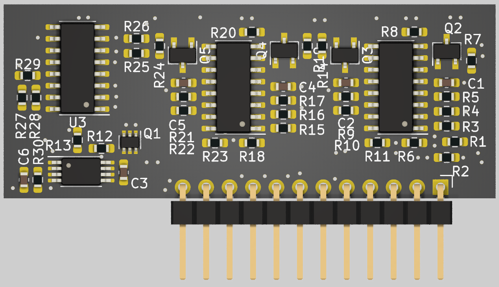
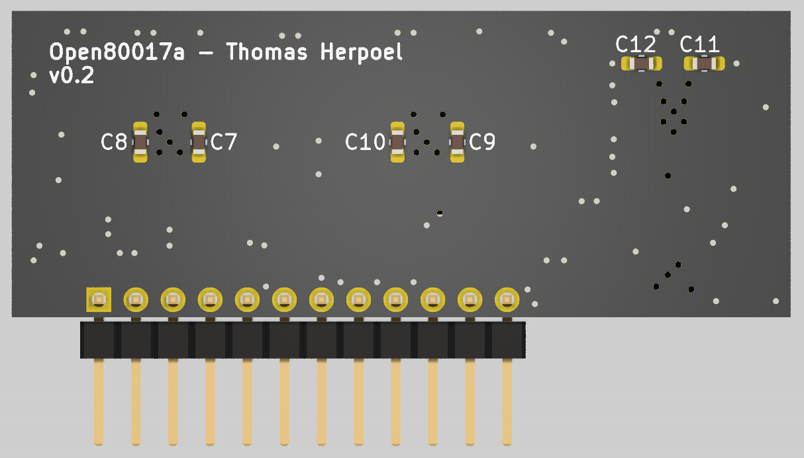

# Open80017a: an Open Source 80017a Roland Clone
<table>
  <tr>
    <td align="center"><b>Top View</b> </td>
    <td align="center"><b>Bottom View</b> </td>
  </tr>
</table>

## Context
The 80017a is a VCF/VCA module encapsulated in resin, used in the voices of various vintage Roland synthesizers such as the Juno-106. These modules are known to fail over time, potentially due to the resin coating.

## Open Source Aftermarket Replacement
While some clone modules are available for sale, they are often hard to find or relatively expensive. To be 100% honest, this project is also mostly a learning opportunity for me in vintage analog synth design.

### Key Design Focus Points
- **EMC Best Practices**
    - 4-layer PCB design
    - Proper trace spacing
- **Thermal Stability**
    - Vias under the OTAs to (try to) thermally couple them using an internal ground plane
- **Miniaturization**
    - Tries to match the original module dimensions

### Schematic

### Production
While the project uses a 4-layer board design, it has not requirements considering impedance control. It can therefore be made with any cheap 4-layer online service.

## Tests
Version 0.1 was assembled and tested in a Juno-106, with no perceivable difference (to my ears) between the clone and the original voices. However, there was an error in the buffer PMOS footprint, which was corrected with bodge wires.

Version 0.2 fixes the footprints. It has not yet been assembled or tested.

## Credits
- This work was motivated by a dead channel on my brother's Juno-106. Thanks for the opportunity to help bro'!

- It would not have been possible without resources found online, especially the information provided by **dksynth** and **guest** on the following forum. Many thanks to them! [https://modwiggler.com/forum/viewtopic.php?t=238335](https://modwiggler.com/forum/viewtopic.php?t=238335)

## Disclaimer

While I did my best to provide a good quality design and I performed a simple test of the design, this project is provided as-is, without any warranty or guarantee. I am not responsible for any damage, malfunction, or harm caused to your hardware, equipment, or any other property resulting from the use, assembly, or modification of this project. Use at your own risk.
